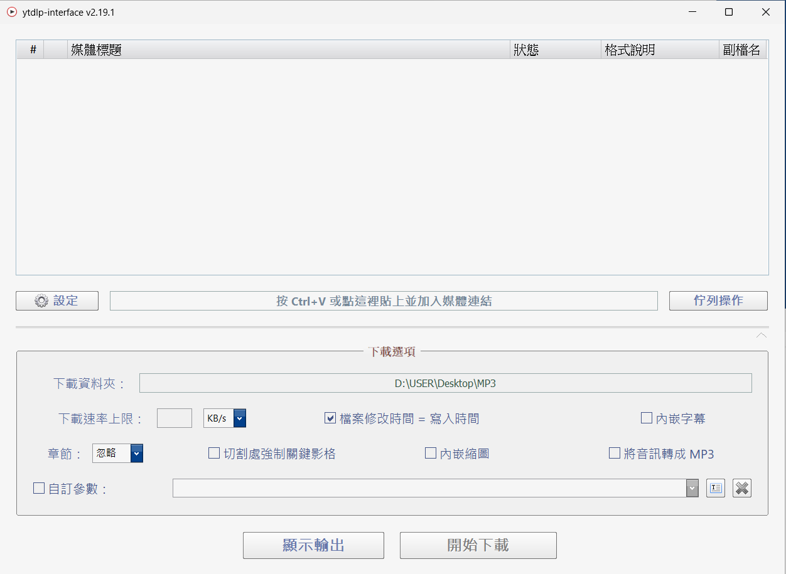
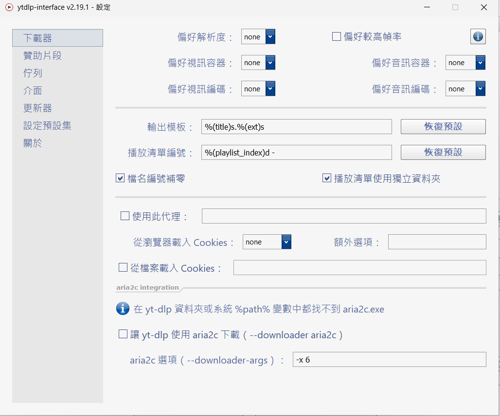
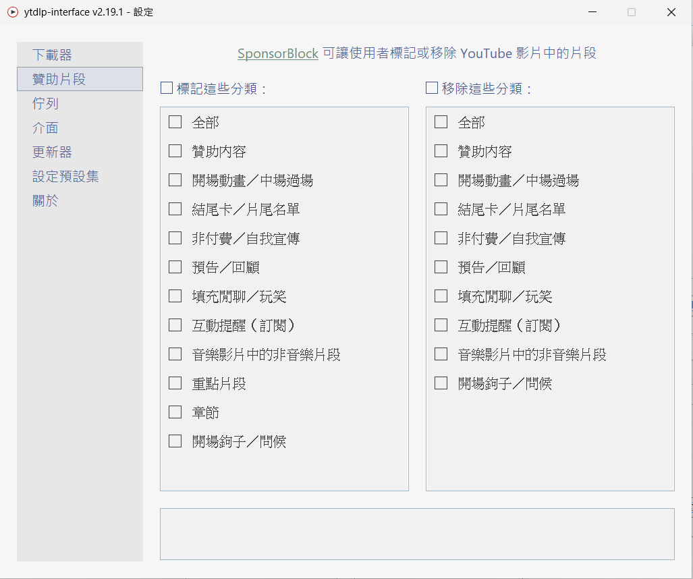
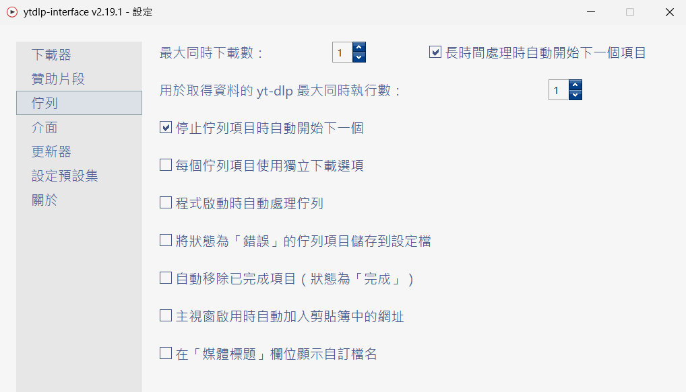
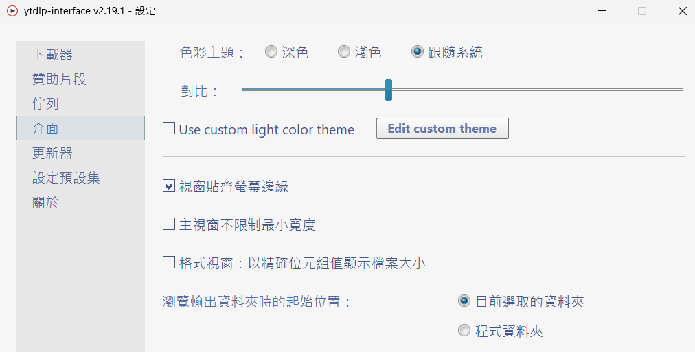
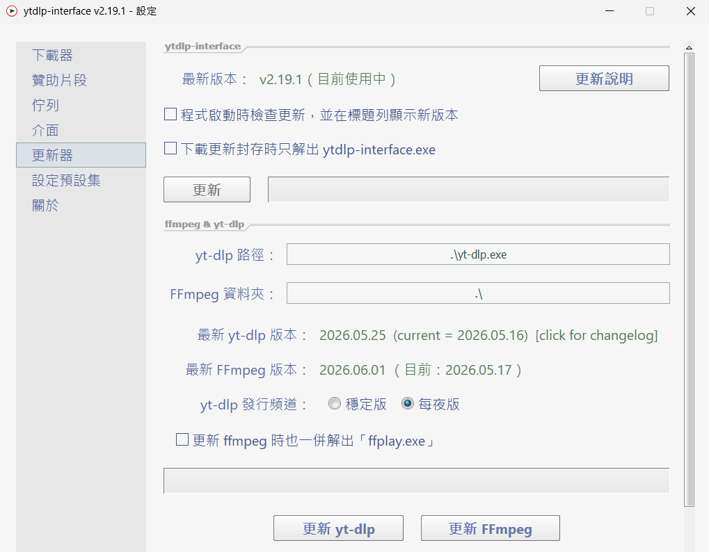
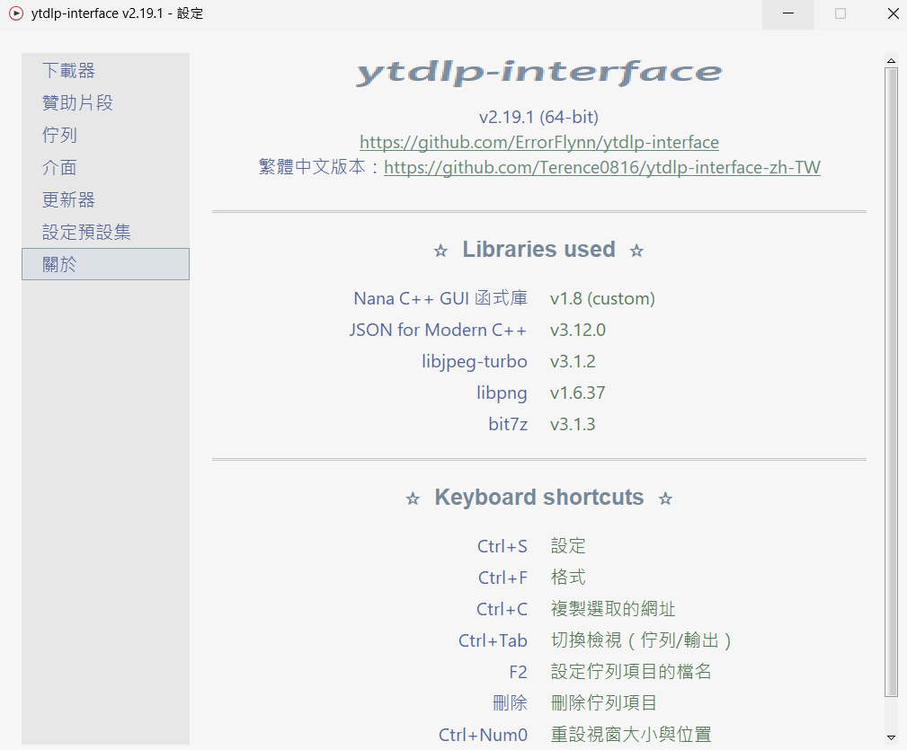

# ytdlp-interface 繁體中文版

這個專案是 [ErrorFlynn/ytdlp-interface](https://github.com/ErrorFlynn/ytdlp-interface) `v2.19.1` 的繁體中文化版本，主要目標是保留原本輕量、直覺的 Windows 下載介面，同時把常用操作、設定頁面與提示訊息整理成繁體中文。

程式本體仍然是 `yt-dlp` 的圖形介面，所以只要網站是 `yt-dlp` 支援的來源，理論上都可以透過這個介面進行下載與整理。

## 這個版本包含什麼

- 主介面與設定頁面繁體中文化
- `ytdlp-interface` 自身更新檢查改為這個繁中版專案
- 保留原本 `yt-dlp`、`FFmpeg` 的上游更新來源
- 附上 `build_zh_tw.bat`，方便在 Windows / Visual Studio 環境重新編譯

## 下載與使用

請到本專案的 [Releases](https://github.com/Terence0816/ytdlp-interface-zh-TW/releases) 頁面下載壓縮檔，解壓後直接執行 `ytdlp-interface.exe` 即可。

若你另外準備了 `yt-dlp.exe`、`ffmpeg.exe`、`ffprobe.exe`，可以和主程式放在同一個資料夾，或在程式設定頁中指定路徑。

## 原始碼建置

### 批次建置

專案根目錄提供 `build_zh_tw.bat`，可在有 Visual Studio / Build Tools、MSBuild、CMake 的 Windows 環境直接編譯：

```bat
build_zh_tw.bat
build_zh_tw.bat Release x64
build_zh_tw.bat Debug Win32
build_zh_tw.bat Release x64 v143
```

這個批次檔會：

1. 自動尋找 Visual Studio 開發環境
2. 若依賴套件尚未解壓，從 `ytdlp-interface dependencies.7z` 自動解開
3. 依序編譯 `nana`、`bit7z`、`libpng`、`libjpeg-turbo`
4. 最後編譯 `ytdlp-interface.sln`

### 手動建置

本專案依賴以下元件：

- [Nana C++ GUI library](https://github.com/cnjinhao/nana) v1.8 以上
- [libjpeg-turbo](https://github.com/libjpeg-turbo/libjpeg-turbo)
- `libpng`
- [bit7z](https://github.com/rikyoz/bit7z)
- [JSON for Modern C++](https://github.com/nlohmann/json)

若要手動建置，先把 `ytdlp-interface dependencies.7z` 解到和 `ytdlp-interface` 同一層。完成後目錄結構應該類似：

- `bit7z`
- `libjpeg-turbo-3.1.2`
- `libpng`
- `nana`
- `ytdlp-interface`

接著建置依賴：

- `nana\build\vc2022\nana.sln`
- `bit7z\bit7z.sln`
- `libpng\libpng.sln`
- `libjpeg-turbo-3.1.2` 以 CMake 建置

全部依賴完成後，再編譯 `ytdlp-interface\ytdlp-interface.sln`。

## 上游專案與授權

本專案基於 [ErrorFlynn/ytdlp-interface](https://github.com/ErrorFlynn/ytdlp-interface) 修改，原作者版權與授權條款維持不變。

- Upstream: [ErrorFlynn/ytdlp-interface](https://github.com/ErrorFlynn/ytdlp-interface)
- License: `MIT`

依照 MIT License 規定，散佈或修改本專案時，應一併保留原始版權聲明與授權條款。完整內容請參考 [LICENSE](LICENSE)。

如果你之後想把這個 GitHub fork 轉成完全獨立的倉庫，可先看這份：[安全脫離 fork network 前的確認清單](docs/leave-fork-network-checklist.md)

## 畫面預覽

主畫面



---

下載器設定



---

SponsorBlock 設定



---

佇列設定



---

介面設定



---

更新器設定



---

關於頁面


